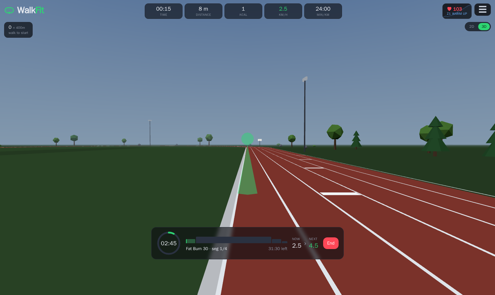
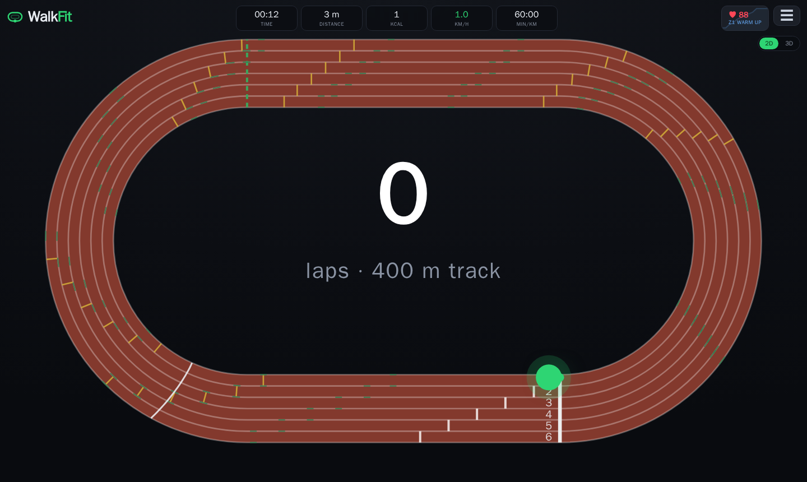
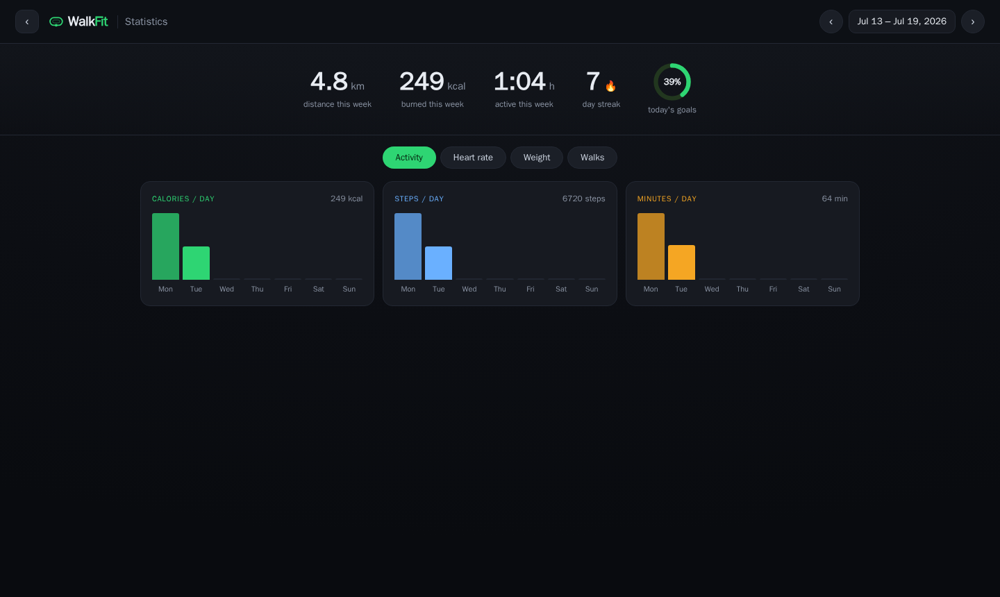
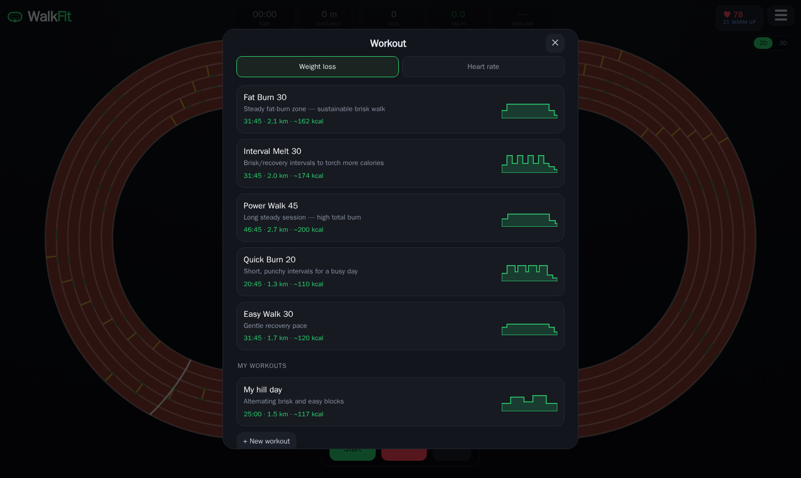

# WalkFit

[](https://github.com/ronaldlokers/WalkFit/actions/workflows/ci.yml)
[](https://github.com/ronaldlokers/WalkFit/actions/workflows/e2e.yml)
[](https://github.com/ronaldlokers/WalkFit/actions/workflows/deploy.yml)


Control a **Dreaver Motion One** walking treadmill (FitShow FS-BT-T4) from the browser over
**Web Bluetooth** — walk a survey-exact virtual 400 m athletics track, follow guided
weight-loss and heart-rate-steered workouts, and track your progress week by week.
No account, no backend: everything lives in your browser.



## Features

- **Virtual 400 m track** — a top-down 2D view and a first-person 3D scenic walk around the
  same IAAF-convention track (real lane staggers, relay zones, hurdle marks, waterfall
  start), with a day/night cycle driven by walked distance and a ghost pacing your all-time
  best lap.
- **Workouts** — preset weight-loss plans, a custom workout builder, and HR-steered sessions
  that nudge belt speed to hold your heart rate in a target zone. Mid-walk you get a
  countdown ring, the next segment's speed before the belt changes, and spoken cues.
- **Heart rate** — connect any standard BLE HR source (chest strap, or a Garmin watch
  broadcasting HR) and see live bpm with your zone; fat-burn is highlighted.
- **Statistics** — a full-page dashboard per calendar week (Mon–Sun): distance, calories,
  active time, day streak, daily goals ring, per-day charts, HR ranges, the walk log, and a
  weight trend with body-fat % and muscle mass when a smart scale provides them.
- **Integrations** — one-tap (or automatic) walk upload to **Strava**; weigh-in sync from a
  **Withings** scale. Both optional.
- **Quality of life** — installable PWA, screen wake lock during walks, session
  pause/resume, mid-walk reload recovery, JSON backup/import, English + Dutch.

| 2D track                                     | Statistics                                          | Workouts                             |
| -------------------------------------------- | --------------------------------------------------- | ------------------------------------ |
|  |  |  |

## Run

```bash
npm install
npm run dev
```

Open the printed `http://localhost:5173` in **Chrome or Edge** (desktop or Android).
Web Bluetooth only works in Chromium browsers and in a secure context — `localhost` counts,
so no HTTPS is needed for local use.

> **On Linux**, Chrome/Chromium keeps Web Bluetooth behind a flag (it's on-by-default only on
> Windows/Mac/Android/ChromeOS). Enable `chrome://flags/#enable-experimental-web-platform-features`
> → **Enabled** → relaunch. If `navigator.bluetooth` is `undefined` in the console, this is why.

**No treadmill at hand?** Append `?demo` to the URL (or set `localStorage['walkfit.demo'] = '1'`):
a simulated belt and HR strap connect automatically and the app is seeded with a few weeks of
realistic data — every feature works, including starting walks and workouts.

### On iPhone / iPad

iOS Safari has no Web Bluetooth. The
[Bluefy](https://apps.apple.com/us/app/bluefy-web-ble-browser/id1492822055) browser bridges
the API to CoreBluetooth — open the app's URL there and connect as usual.

## Use

1. **Connect treadmill** — pick "Dreaver Motion One" in the browser prompt. The device is
   remembered; next time it reconnects silently.
2. **Start** — the belt beeps and counts 3-2-1, then moves. Note: this treadmill has **no
   safety key or other physical stop-guard** — stand ready, and keep the Stop control in
   reach.
3. Set speed with the slider or ± buttons, or pick a free-walk goal (1/2/5 km, 20/30 min) —
   you'll hear a cue at halfway and on reaching it. Watch your runner lap the 400 m track,
   or flip to the 3D scenic walk.
4. **Pause** keeps the session open (Start resumes it); **Stop** ends and logs the walk.

### Workouts

Open the **☰** menu → **Workout** for preset weight-loss sessions (steady fat-burn and
intervals, 20–45 min), your own custom plans (build them right in the picker), or an
HR-steered workout that adjusts belt speed every 20 s to hold a heart-rate zone. During a
plan the ribbon shows a segment countdown, the current → next speed, and time remaining;
speed changes are announced 5 seconds ahead. Every preset ends with a cooldown.

### Heart rate

The header's **♥** badge connects any standard BLE heart-rate source (Bluetooth Heart Rate
Service). On a Garmin watch: enable _Broadcast Heart Rate_ (controls menu, or Settings →
Sensors & Accessories → Wrist Heart Rate). Set your **Max HR** in Settings to tune the
zones — the green **Fat burn** band (60–70% of max) is the weight-loss sweet spot. The
treadmill and HR sensor are independent Bluetooth connections; connect each once and both
reconnect automatically afterwards.

### Statistics

**☰ → Statistics** opens the weekly dashboard: navigate weeks with ‹ ›, tap the date label
for a picker, and switch tabs for activity charts, HR ranges, the weight trend (goal line,
body fat, muscle), and the walk log with per-walk detail. Daily goals (calories, steps,
active minutes) are configurable in Settings.

## How it talks to the treadmill

Reverse-engineered protocol (`src/protocol.ts` + `src/treadmill.ts`):

- Connect over **BLE** (not classic Bluetooth — that only exposes audio profiles).
- **Start/stop** via the standard FTMS Control Point `0x2ad9`: `00` request control,
  `07` start, `08 01` stop, `08 02` pause.
- **Speed** via the FitShow vendor write characteristic `0xfff2` (FTMS set-speed is ignored
  by this firmware): frame `02 53 02 <km/h×10> <xor> 03`.
- **Telemetry** on vendor notify `0xfff1` — with three firmware quirks the app handles:
  the belt ignores speed writes during its 3-2-1 countdown (bounded retry window),
  interleaves phantom frames at exactly 2× the real speed (filtered by taking the minimum
  over ~1.5 s), and doesn't stream unprompted (polled at ~1 Hz; "stopped" is derived from
  telemetry going stale, not from status frames).

Distance/time are integrated client-side from the live speed, so the track stays accurate
regardless of the device's own counters.

## Development

```bash
npm test           # unit tests (Vitest)
npm run e2e        # Playwright end-to-end + screenshot baseline
npm run typecheck  # vue-tsc, strict
npm run lint       # ESLint
```

CI runs lint, format, typecheck, unit tests, build, and a bundle-size guard on every PR;
a separate workflow runs the e2e suite in the pinned Playwright container. Architecture
notes live in [CLAUDE.md](CLAUDE.md); the OAuth token proxy for Strava/Withings is a small
Cloudflare Worker in [`oauth-proxy/`](oauth-proxy/README.md).
